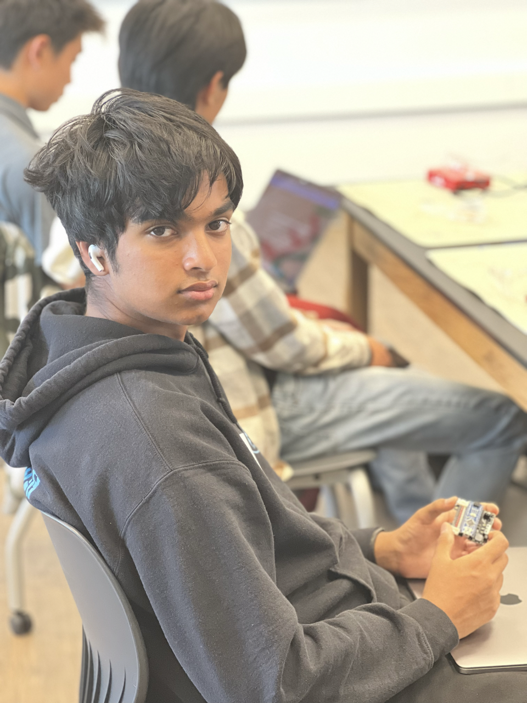

  # 3-Jointed robotic arm
<!---
Replace this text with a brief description (2-3 sentences) of your project. This description should draw the reader in and make them interested in what you've built. You can include what the biggest challenges, takeaways, and triumphs from completing the project were. As you complete your portfolio, remember your audience is less familiar than you are with all that your project entails!
-->

| **Engineer** | **School** | **Area of Interest** | **Grade** |
|:--:|:--:|:--:|:--:|
| Harish B | Mission San Jose High | Mechanical Engineering | Incoming jounior 


  
# Final Milestone
<!---
For your final milestone, explain the outcome of your project. Key details to include are:
- What you've accomplished since your previous milestone
- What your biggest challenges and triumphs were at BSE
- A summary of key topics you learned about
- What you hope to learn in the future after everything you've learned at BSE

**Don't forget to replace the text below with the embedding for your milestone video. Go to Youtube, click Share -> Embed, and copy and paste the code to replace what's below.**

<iframe width="560" height="315" src="https://www.youtube.com/embed/F7M7imOVGug" title="YouTube video player" frameborder="0" allow="accelerometer; autoplay; clipboard-write; encrypted-media; gyroscope; picture-in-picture; web-share" allowfullscreen></iframe>
-->
## Summary
My final milestone was achieved when I made my chassis able to move using wireless communication. Previously I had all the joysticks wired directly into the onboard Arduino, however now I have used a wireless module to wire all the joysticks to a separate Arduino, making the two arduinos communicate with each other.

## Components 
1. nRF24L01+ modules - This is what allowed the two arduinos to communicate with each other

How all these components work together is that the joysticks are wired to the Arduino Nano along with the nRF24L01+ module. Now this nRF24L01+ module sends a signal to the other nRF24L01+ module that is connected to the Arduino Mega onboard the chassis. Then through coding, the nano takes in the joystick values, compresses them then sends the values into the mega. The mega now takes in the values and then sends them to the motors to move in that specific direction. 

## Progress 
This was my final milestone, so I have accomplished everything I wanted to. However, I was unable to complete the coding of my arm I plan on completing that in my own time.

## Challenges
My challenge was getting the two nRF24L01+ modules to communicate with each other. It took many hours of research to figure out that I was not using the default sck, mosi, and miso so the data never got to the Arduino.

## Next steps 
My next step is to complete the code for my custom arm and attach it onto my chassis where the old arm currently is.


# Second Milestone
<iframe width="560" height="315" src="https://www.youtube.com/embed/B5Mugl8oNbk" title="YouTube video player" frameborder="0" allow="accelerometer; autoplay; clipboard-write; encrypted-media; gyroscope; picture-in-picture; web-share" allowfullscreen></iframe>

## Summary
My second milestone was achieved when I accomplished my goal of adding wheels to the claw in order to have more movement. The claw originally was only able to pick up things near it and that severely held it back from doing anything, and I fixed this by designing a chassis in Fusion 360 and 3D-printing it to hold the claw on the back while being able to move in a direction I pleased in order for the claw to pick up more items.  

## Components
1. Arduino Mega - This is the controller of the arm, it takes in the inputs of the joysticks and using the programmed code sends a signal to the servos to move that much. It has much more of the same pins than the Arduino Nano allowing for more components to be added
2. L298N motor driver - This motor driver controls the direction and power of the dc motors that are on the chassis.
3. Dc motors - These motors are more powerful than servos and are used to move my wheels since they have a continuous rotation unlike servos which only go from 0-270
4. Mehcanum wheels - These are wheels that have a unique roller on their outer diameter allowing them when all four spun in a certain direction they move side to side in what's known as strafing.

This all works together starting at the joysticks where once detected input will send it into the Arduino mega. The Arduino Mega now takes in the joystick input and turns it into something that the H bridge can understand and sends it to the H bridge. The H bridge now takes the input from the Arduino Mega and sends it to the two dc motors that are connected to it and the dc motors turn the mechanum wheels that are attached to it 

## Progress 
My customizations have gone decently well, I started with designing and 3D-printing a stronger arm with stronger servos to hold stronger things, however, the coding of the arm didn't work so I was unable to get the arm working. Then I decided to give the claw more movement as I've added wheels to the base of the arm in order to move it more.

## Challenges
My main challenge was coding my modified arm, I was using the previous arms code however the one I designed had 2 servos for more power on the claw and one of the servos were in the opposite direction. After assembling the arm and beginning to code the arm I realized the code was very hard to understand as it had no documentation as to how the custom libraries that the default arm had worked which was difficult for me. 

## Next steps
My next step is to make the controller and joysticks wireless as the messy wiring makes it aesthetically unpleasant and restricts the distance I have to be from the claw.
<iframe width="560" height="315" src="https://www.youtube.com/embed/7PaMYvwxk2c" title="YouTube video player" frameborder="0" allow="accelerometer; autoplay; clipboard-write; encrypted-media; gyroscope; picture-in-picture; web-share" allowfullscreen></iframe>

# First Milestone

## Summary
My first milestone was achieved when I managed to control my arm manually and pick up a paper cylinder. I did this by first assembling the arm and utilizing the 3 servo pivots to maneuver my arm in various directions. 
## Components 
1. 5g Servos - these are what move the arm, they are programmed to move from anywhere from 0-180 degrees.
2. Arduino Nano - this is what takes the code and inputs and tells certain pins on the Arduino to power, essentially it moves and controls the servos. The Arduino nano has pins on the bottom which vary from grounding, 5-volt power, reading and transmitting data, and data ports. The data ports are used to receive and send signals to the different things connected to it for example in my case how much to move the servo. Also, It can be used to receive, when it takes the input of the joystick.
3. Arduino Nano shield - this takes the pins of the Arduino and expands it to be more user-friendly. It also adds the necessary components to input more power into the system as the servos need more than the 5v that the Arduino provides. I used this to plug in my servos and also used this to add my 9v power supply.
4. Joysticks - This turns the hand movements into signals that the Arduino can understand and is used to control the arm

How this all works together is that the joysticks send a signal into the Arduino nano shield, then that Arduino nano takes the input from the arduino shield and turns it into the right servo movement from the code uploaded to the Arduino nano and sends a signal to the servos to move to that position. 

## Challenges
One main challenge I faced was trying to add my Bluetooth module to control the arm using a phone app. When trying to connect the first issue I encountered was that I was unable to build my code onto the Arduino. The reason for this was I was plugging the bluetooth modules transmitting data cable into the default read data pin on the Arduino. This meant that the Arduino wasn't reading the code I was uploading but the bluetooth module was instead so the code didn't upload.

## Next steps
My next step for this project is to create a wireless controller as right now the joysticks have to be plugged into the Arduino shield which is very inconvenient. I also am going to strengthen the arm to hold at least two AA batteries along with putting it on wheels to add more maneuverability to the arm.

<iframe width="560" height="315" src="https://www.youtube.com/embed/bRiTaQy16FM" title="YouTube video player" frameborder="0" allow="accelerometer; autoplay; clipboard-write; encrypted-media; gyroscope; picture-in-picture; web-share" allowfullscreen></iframe>

# Starter Project

## Summary
For my starter project I built a Simon says game. The game works by pushing the rubber pad onto the motherboard to complete the circuit allowing the microcontroller to understand that the button has been pressed. The goal is to click the colors in the order the game displays them using the LEDs. 

## Components 
1. ATmega328 - this is the brains of the game and holds the code which is preprogrammed in.
2. 10k resistor - this makes sure that the whole circuit isn't overloaded from the power being inputted. It takes the power and only lets some pass and lets the rest go as heat
3. Through-hole PCB - this connects all the components together in an organized manner.
4. Battery clips - this takes the battery charge and inputs it into the PCB. It acts as a bridge for the battery to the PCB
5. Slide switch - this turns on and off certain parts of the PCB, for example, the power and sound. I simply just break and connects different circuits
6. 0.1μF Capacitor - this stores and releases energy

## Challenges
The only challenge I faced was understanding which sides are positive and negative since they were not labeled, and to identify them I used a multimeter and used black and red pins to check continuity.

## Next Steps 
My next step is to start working on my intensive project which is the 3-jointed robotic arm

# Schematics 
<!---
Here's where you'll put images of your schematics. [Tinkercad](https://www.tinkercad.com/blog/official-guide-to-tinkercad-circuits) and [Fritzing](https://fritzing.org/learning/) are both great resoruces to create professional schematic diagrams, though BSE recommends Tinkercad becuase it can be done easily and for free in the browser. 
-->

# Code
```c++
//Transmitter code onboard the arduino nano

#include <SPI.h>
#include <RF24.h>
#include <nRF24L01.h>

RF24 radio(9, 8); // CE, CSN
const byte address[10] = "ADDRESS01";


int joystickValue;
int joystickValue1;
int joystickValue2;
int joystickValues;
int joystickValue1s;
int joystickValue2s;
void setup() {

 Serial.begin(9600);
  radio.begin();
  radio.openWritingPipe(address);
  radio.setPALevel(RF24_PA_MIN);
  radio.stopListening();
pinMode(A0, INPUT);
pinMode(A1, INPUT);
pinMode(A2, INPUT);
pinMode(A3, INPUT);
pinMode(A4, INPUT);
pinMode(A5, INPUT);
//Serial.begin(9600);
}

void loop() {
const char back = 'b'; 
const char stop = 's'; 
const char forward = 'f'; 
const char right = 'r'; 
const char left = 'l';
const char turn = 't';
const char turt = 'y'; 
  joystickValue = analogRead(A0);
  joystickValues = analogRead(A1);
  joystickValue1 = analogRead(A2);
  joystickValue1s = analogRead(A3);
  joystickValue2 = analogRead(A4);
  joystickValue2s = analogRead(A5);


//Serial.println(joystickValue2s); 
  if (joystickValue2s <= 150) {
    delay(500);
    radio.write(&forward, sizeof(forward));
    //Serial.println("FORWARD");
  }
  if (joystickValue2s >= 700) {
    radio.write(&back, sizeof(back));
    delay(500);
    //Serial.println("BACK"); 
  }
  if (joystickValue2s >150 && joystickValue2s <700 && joystickValue2 >150 && joystickValue2 <700 ) {
    //Serial.println("STOP");
    radio.write(&stop, sizeof(stop));
  
  }
  if (joystickValue2 <= 150) {
    //Serial.println("RIGHT");
    radio.write(&right, sizeof(right));
    delay(500);
  }
  if (joystickValue2 >= 700) {
    //Serial.println("LEFT");
    radio.write(&left, sizeof(left));
    delay(500);
  }
  if (joystickValue1 <= 150) {
    Serial.println("turn");
    radio.write(&turn, sizeof(turn));
    delay(500);
  }
  if (joystickValue1s >= 700) {
    Serial.println("turt");
    radio.write(&turt, sizeof(turt));
    delay(500);
  }
}
// Receiver code onboard the Arduino mega
#include "src/CokoinoArm.h"
#define buzzerPin 9
#include <SPI.h>
#include <RF24.h>
#include <nRF24L01.h>
#include <Arduino.h>
int in1Pin = 37;
int in2Pin = 33;
int in3Pin = 31;
int in4Pin = 35;
int in5Pin = 30;
int in6Pin = 32;
int in7Pin = 34;
int in8Pin = 36;
int motorPWMSpeed = 0;
char txt;
RF24 radio(7, 8); // CE, CSN
const byte address[10] = "ADDRESS01";

CokoinoArm arm;
int xL,yL,xR,yR;

const int act_max=10;    //Default 10 action,4 the Angle of servo
int act[act_max][4];    //Only can change the number of action
int num=0,num_do=0;

///////////////////////////////////////////////////////////////
void turnUD(void){
  if(xL!=512){
    if(0<=xL && xL<=100){arm.up(10);return;}
    if(900<xL && xL<=1024){arm.down(10);return;} 
    if(100<xL && xL<=200){arm.up(20);return;}
    if(800<xL && xL<=900){arm.down(20);return;}
    if(200<xL && xL<=300){arm.up(25);return;}
    if(700<xL && xL<=800){arm.down(25);return;}
    if(300<xL && xL<=400){arm.up(30);return;}
    if(600<xL && xL<=700){arm.down(30);return;}
    if(400<xL && xL<=480){arm.up(35);return;}
    if(540<xL && xL<=600){arm.down(35);return;} 
    }
}
///////////////////////////////////////////////////////////////
void turnLR(void){
  if(yL!=512){
    if(0<=yL && yL<=100){arm.right(0);return;}
    if(900<yL && yL<=1024){arm.left(0);return;}  
    if(100<yL && yL<=200){arm.right(5);return;}
    if(800<yL && yL<=900){arm.left(5);return;}
    if(200<yL && yL<=300){arm.right(10);return;}
    if(700<yL && yL<=800){arm.left(10);return;}
    if(300<yL && yL<=400){arm.right(15);return;}
    if(600<yL && yL<=700){arm.left(15);return;}
    if(400<yL && yL<=480){arm.right(20);return;}
    if(540<yL && yL<=600){arm.left(20);return;}
  }
}
///////////////////////////////////////////////////////////////
void turnCO(void){
  if(xR!=512){
    if(0<=xR && xR<=100){arm.close(0);return;}
    if(900<xR && xR<=1024){arm.open(0);return;} 
    if(100<xR && xR<=200){arm.close(5);return;}
    if(800<xR && xR<=900){arm.open(5);return;}
    if(200<xR && xR<=300){arm.close(10);return;}
    if(700<xR && xR<=800){arm.open(10);return;}
    if(300<xR && xR<=400){arm.close(15);return;}
    if(600<xR && xR<=700){arm.open(15);return;}
    if(400<xR && xR<=480){arm.close(20);return;}
    if(540<xR && xR<=600){arm.open(20);return;} 
    }
}
///////////////////////////////////////////////////////////////
void date_processing(int *x,int *y){
  if(abs(512-*x)>abs(512-*y))
    {*y = 512;}
  else
    {*x = 512;}
}
void setup() {
  Serial.begin(9600);
  radio.begin();
  radio.openReadingPipe(0, address);
  radio.setPALevel(RF24_PA_MIN);
  radio.startListening();
  //Serial.begin(9600);
  //arm of servo motor connection pins
  arm.ServoAttach(9,10,11,12);
  //arm of joy stick connection pins : xL,yL,xR,yR
  arm.JoyStickAttach(A0,A1,A2,A3);
  //pinMode(buzzerPin,OUTPUT);
  pinMode(in1Pin, OUTPUT);
  pinMode(in2Pin, OUTPUT);
  pinMode(in3Pin, OUTPUT);
  pinMode(in4Pin, OUTPUT);
  pinMode(in5Pin, OUTPUT);
  pinMode(in6Pin, OUTPUT);
  pinMode(in7Pin, OUTPUT);
  pinMode(in8Pin, OUTPUT);
  
}
///////////////////////////////////////////////////////////////
void loop() {
  xL = arm.JoyStickL.read_x();
  yL = arm.JoyStickL.read_y();
  xR = arm.JoyStickR.read_x();
  yR = arm.JoyStickR.read_y();
  date_processing(&xL,&yL);
  date_processing(&xR,&yR);
  turnUD();
  turnLR();
  turnCO();

    //char txt = "";
    radio.read(&txt,1);
    Serial.println(txt);
    if (txt == 'b') {
    digitalWrite(in1Pin, HIGH);
    digitalWrite(in2Pin, LOW);
     digitalWrite(in3Pin, LOW);
    digitalWrite(in4Pin, HIGH);
    digitalWrite(in5Pin, LOW);
    digitalWrite(in6Pin, HIGH);
     digitalWrite(in7Pin, HIGH);
    digitalWrite(in8Pin, LOW);
    Serial.println("BLAH");
    }
     if (txt == 's') {
       Serial.println("SBLATYH");
       digitalWrite(in1Pin, LOW);
    digitalWrite(in2Pin, LOW); 
    digitalWrite(in3Pin, LOW);
    digitalWrite(in4Pin, LOW);
    digitalWrite(in5Pin, LOW);
    digitalWrite(in6Pin, LOW); 
    digitalWrite(in7Pin, LOW);
    digitalWrite(in8Pin, LOW);
     }
     if (txt == 'f'){
       Serial.println("Bblah");
       digitalWrite(in1Pin, LOW);
    digitalWrite(in2Pin, HIGH);
    digitalWrite(in3Pin, HIGH);
    digitalWrite(in4Pin, LOW);
    digitalWrite(in5Pin, HIGH);
    digitalWrite(in6Pin, LOW);
    digitalWrite(in7Pin, LOW);
    digitalWrite(in8Pin, HIGH); 
     }
     if (txt == 'l') {
digitalWrite(in1Pin, LOW);
    digitalWrite(in2Pin, HIGH);
     digitalWrite(in3Pin, LOW);
    digitalWrite(in4Pin, HIGH);
    digitalWrite(in5Pin, HIGH);
    digitalWrite(in6Pin, LOW);
     digitalWrite(in7Pin, HIGH);
    digitalWrite(in8Pin, LOW);
     }
     if (txt == 'r') {
       digitalWrite(in1Pin, HIGH);
      digitalWrite(in2Pin, LOW);
      digitalWrite(in3Pin, HIGH);
      digitalWrite(in4Pin, LOW);
      digitalWrite(in5Pin, LOW);
      digitalWrite(in6Pin, HIGH);
      digitalWrite(in7Pin, LOW);
      digitalWrite(in8Pin, HIGH);
     }
     if (txt == 't'){
       digitalWrite(in1Pin, LOW);
    digitalWrite(in2Pin, HIGH);
    digitalWrite(in3Pin, HIGH);
    digitalWrite(in4Pin, LOW);
       digitalWrite(in5Pin, LOW);
    digitalWrite(in6Pin, HIGH);
     digitalWrite(in7Pin, HIGH);
    digitalWrite(in8Pin, LOW);
     }
}
}
```
# Bill of Materials
Here's where you'll list the parts in your project. To add more rows, just copy and paste the example rows below.
Don't forget to place the link of where to buy each component inside the quotation marks in the corresponding row after href =. Follow the guide [here]([url](https://www.markdownguide.org/extended-syntax/)) to learn how to customize this to your project needs. 

| **Part** | **Note** | **Price** | **Link** |
|disfjojfios|sodifosj|sdijfoisjdf|jdosfijsdfkl|
| Arduino Mega | Controlling the diffrent components on the project chassis | $20.99 | <a href="https://www.amazon.com/ELEGOO-ATmega2560-ATMEGA16U2-Projects-Compliant/dp/B01H4ZLZLQ/ref=asc_df_B01H4ZLZLQ/?tag=hyprod-20&linkCode=df0&hvadid=309743296044&hvpos=&hvnetw=g&hvrand=12020245290984826104&hvpone=&hvptwo=&hvqmt=&hvdev=c&hvdvcmdl=&hvlocint=&hvlocphy=9032183&hvtargid=pla-490931309987&psc=1"> Link </a> |
|:--:|:--:|:--:|:--:|
| Arduino Nano | Controlling the diffrent components on the transmitter | $10.99 | <a href="https://www.amazon.com/ATmega328P-Microcontroller-Board-Cable-Arduino/dp/B00NLAMS9C/ref=asc_df_B00NLAMS9C/?tag=hyprod-20&linkCode=df0&hvadid=309776868400&hvpos=&hvnetw=g&hvrand=13247452225808741269&hvpone=&hvptwo=&hvqmt=&hvdev=c&hvdvcmdl=&hvlocint=&hvlocphy=9032183&hvtargid=pla-593018008274&psc=1"> Link </a> |
|:--:|:--:|:--:|:--:|
| Joysticks | inputing commands into the arduino from finger movements  | $8.99 | <a href="https://www.amazon.com/Joystick-Controller-Compatible-Raspberry-PlayStation-2/dp/B0BFQTLM5T/ref=asc_df_B0BFQTLM5T/?tag=hyprod-20&linkCode=df0&hvadid=642135768472&hvpos=&hvnetw=g&hvrand=13644171287524340115&hvpone=&hvptwo=&hvqmt=&hvdev=c&hvdvcmdl=&hvlocint=&hvlocphy=9032183&hvtargid=pla-1948409564586&psc=1&gclid=CjwKCAjw44mlBhAQEiwAqP3eVoPFrTldpZcr07SQ8AAIVws4saFl-DYrku3biS5c-wGW6YBDUAnmWxoCAzAQAvD_BwE"> Link </a> |
|:--:|:--:|:--:|:--:|


<--
# Other Resources/Examples
One of the best parts about Github is that you can view how other people set up their own work. Here are some past BSE portfolios that are awesome examples. You can view how they set up their portfolio, and you can view their index.md files to understand how they implemented different portfolio components.
- [Example 1](https://trashytuber.github.io/YimingJiaBlueStamp/)
- [Example 2](https://sviatil0.github.io/Sviatoslav_BSE/)
- [Example 3](https://arneshkumar.github.io/arneshbluestamp/)

To watch the BSE tutorial on how to create a portfolio, click here.
-->
